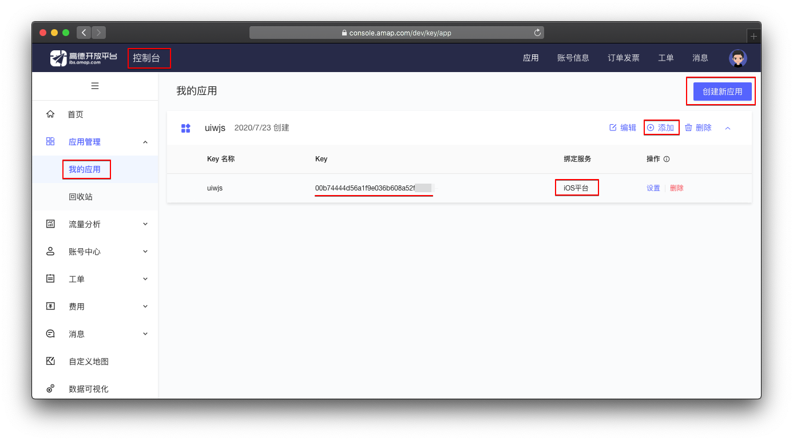
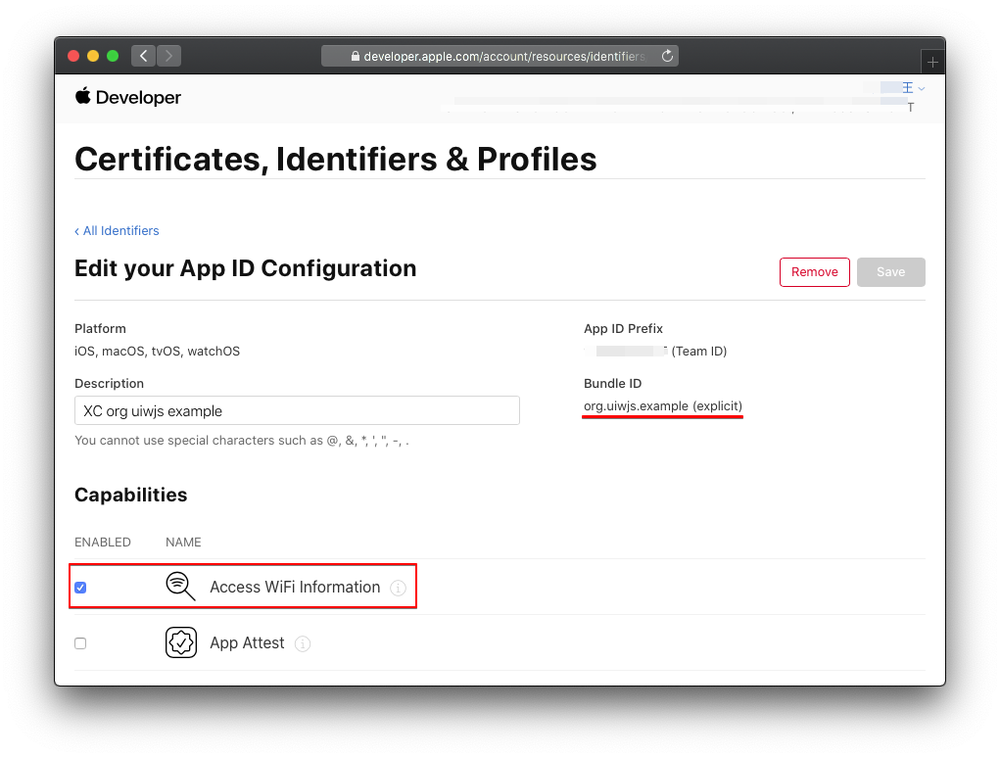
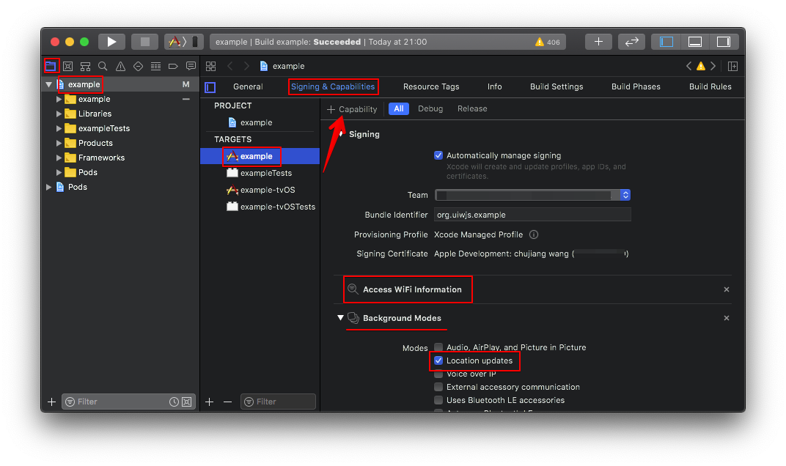

@uiw/react-native-amap-geolocation
----

[](https://npmjs.org/package/@uiw/react-native-amap-geolocation)

React Native 高德地图定位模块，支持 Android/iOS

## 注意事项

<details>
<summary>Android：需要正确的设置 apiKey，获取 Key 的方法</summary>

<br />

官方获取 Key方法：https://lbs.amap.com/api/android-location-sdk/guide/create-project/get-key

A. 使用 `keytool`（jdk自带工具）获取 `SHA1`，默认 测试版本 `keystore` 路径 `<项目名称>/android/app/debug.keystore`

```bash
keytool -v -list -keystore  keystore文件路径
```

B. 获取 `PackageName`，获取路径 `<项目名称>/android/app/src/main/AndroidManifest.xml`

C. 在高德地图账号中设置 `SHA1` 和 `PackageName`。


D. 按照上面步骤正确设置你的 `apiKey` 才会起作用。

</details>

<details>
<summary>iOS：获取逆地理信息需要高德地图配置 apiKey</summary>



</details>

<details>
<summary>iOS：高德地图包需要 WiFi 权限</summary>

<br />

iOS 端高德地图包需要 WiFi 权限，否则报如下警告：

```
nehelper sent invalid result code [1] for Wi-Fi information request
```

需要在[开发者账号中设置 WiFi 权限](https://developer.apple.com)



同时需要在 Xcode 中添加 `Access WiFi Information` 能力选项



</details>

<details>
<summary>iOS：需要保证"Background Modes"中的"Location updates"处于选中状态</summary>


</details>

## 安装依赖

```bash
yarn add @uiw/react-native-amap-geolocation
# react-native version >= 0.60+
$ cd ios && pod install
```

## Usage

```javascript
import { Platform } from 'react-native';
import AMapGeolocation from '@uiw/react-native-amap-geolocation';

let apiKey = '';

if (Platform.OS === 'ios') {
  apiKey = '用于 iOS 的 apiKey';
}
if (Platform.OS === 'android') {
  apiKey = '用于 Android 的 apiKey';
}

// 设置 高德地图 apiKey
AMapGeolocation.setApiKey(apiKey);
// 指定所需的精度级别
AMapGeolocation.setDesiredAccuracy(3);
// 连续定位是否返回逆地理信息
AMapGeolocation.setLocatingWithReGeocode(true);

async function getCurrentLocation(){
  try {
    const json = await AMapGeolocation.getCurrentLocation();
    console.log('json:', json);
  } catch (error) {
    console.log('error:', error);
  }
}
```

## 错误处理

```bash
[NetworkInfo] Signal strength query returned error: Error Domain=NSPOSIXErrorDomain Code=13 "Permission denied", descriptor: <CTServiceDescriptor 0x283317100, domain=1, instance=1>
```

在 `Product` -> `Scheme` -> `Edit Scheme` -> `Run` -> `Arguments` -> `Environment Variables` 添加 `OS_ACTIVITY_MODE` `disable`

```bash
nehelper sent invalid result code [1] for Wi-Fi information request
```

配置 WiFi 权限

## iOS 配置后台定位

1. 左侧目录中选中工程名，开启 `TARGETS` -> `Capabilities` -> `Background Modes`
2. 在 `Background Modes` 中勾选 `Location updates`

## 其它

当前工程基于 [@brodybits/create-react-native-module](https://github.com/brodybits/create-react-native-module) 初始化。

```bash
npx create-react-native-module --package-identifier com.uiwjs.react.geolocation --object-class-name RNAMapGeolocation --generate-example AMapGeolocation --example-react-native-version 0.63.0 --module-name @uiw/react-native-amap-geolocation --github-account uiwjs --author-name "Kenny Wong" --author-email "wowohoo@qq.com"
```

## 相关连接 

- [高德地图：Android 端类文档](http://amappc.cn-hangzhou.oss-pub.aliyun-inc.com/lbs/static/unzip/Android_Location_Doc/index.html)
- [高德地图：iOS定位SDK V2.6.5](https://lbs.amap.com/api/ios-location-sdk/download/)
- [高德地图：Android 定位SDK V5.1.0](https://lbs.amap.com/api/android-location-sdk/download)
- [高德地图：提交 AppStore 必读](https://lbs.amap.com/api/ios-location-sdk/guide/create-project/idfa-guide)
